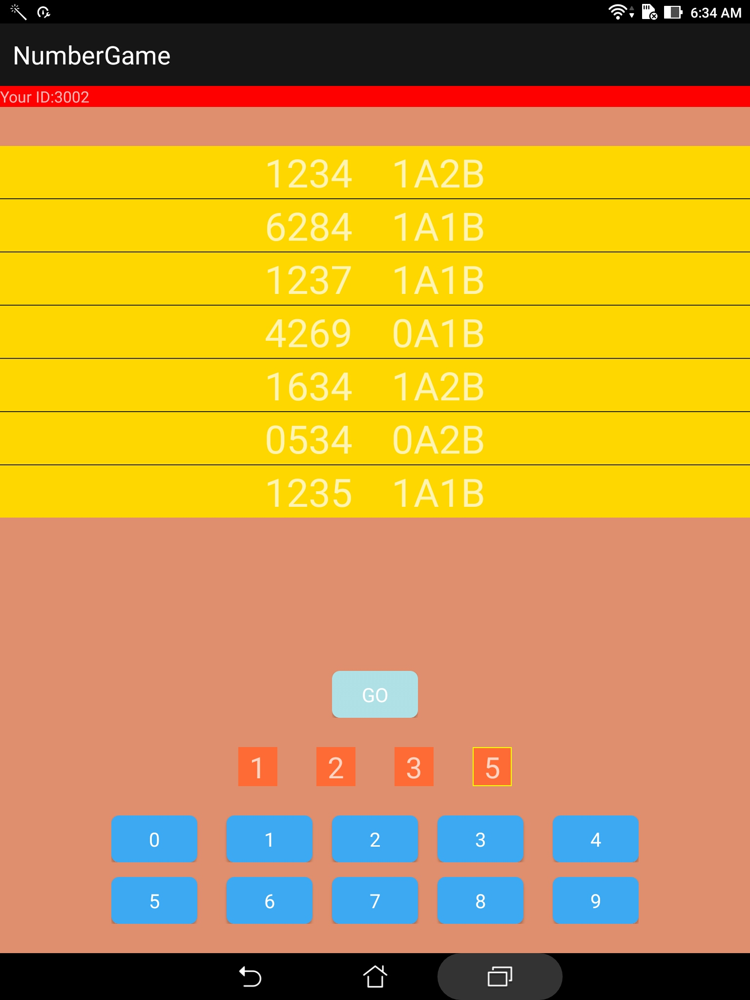

# AB Number Guessing Game

This is a AB Number Guessing Game AKA well known [Bulls and Cows](https://en.wikipedia.org/wiki/Bulls_and_Cows).
An Old, simple but fun game.  
You can fight with your friend to see who can guess the number first! Hope you enjoy the game ! 
This repository is for client side on Android phone. You can [check server side](https://github.com/JasperHsieh/NumberGameServer) 

### Rules
- There will be a secret number which is a 4 digits number with four different number from 0 to 9.
- Two players will try to guess the secret number produce by server in turns. Faster one wins.
- If the matching digits are in right position, thet are "Bulls". (Sign "A")  
  If in different posistion, they are "cows". (Sign "B")  
  
### How to find your opponent
- Enter the oppoent's ID
- The server will help you to find him.

### In the fight mode you can
- Have 1 to 1 battle with your friend any where.
- Brainstorming
- Find new spark of this old game.

### How this app works
Basically the app is sending POST request to query data from [server](https://github.com/JasperHsieh/NumberGameServer) . 
There can be devided into two state. 

##### Pairing state
In this state, first you will need to enter opponent's ID and submit it.  
Its kind of llke bluetooth pairing procedure. THis app will register players' ID to server database.  
After registering player's ID, the app will keep checking if your opponent is registered or not from server.  
Once it found oppoent is registered, the game will start immediately.

##### Gaming state
In this state, this app will decide wether the player can submit number since the players should take turns  
And of course the most import part is to submit number to server.  
It is sent by POST request too.  

I wrote this APP just for fun. Feel free to use it!

